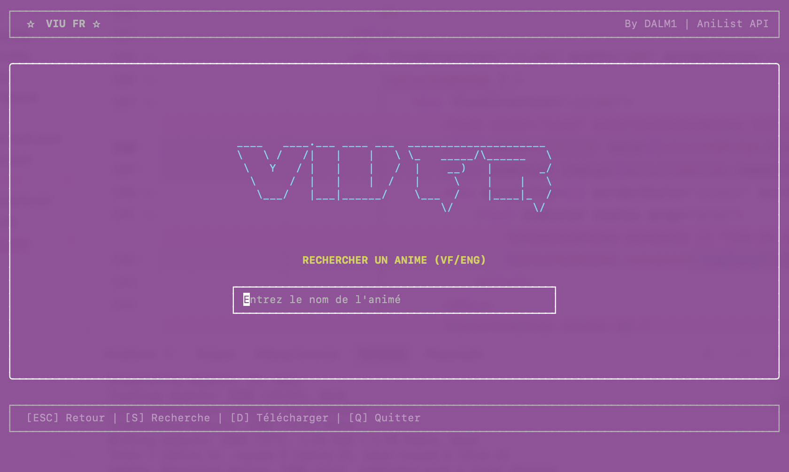
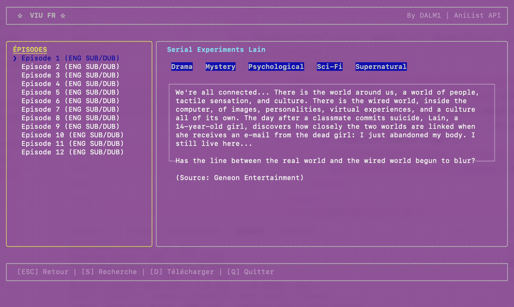

```text
____   ____.___ ____ ___  _____________________
\   \ /   /|   |    |   \ \_   _____/\______   \
 \   Y   / |   |    |   /  |    __)   |       _/
  \     /  |   |    |  /   |     \    |    |   \
   \___/   |___|______/    \___  /    |____|_  /
                               \/            \/
```




**VIU-FR** est une expérience de streaming d'animés directement depuis votre terminal, inspirée par [Viu](https://github.com/viu-media/viu). Il combine la puissance de l'API AniList pour les métadonnées et des scrapers optimisés pour les sources françaises.

---

## Fonctionnalités

- **Interface TUI Interactive** : Navigation fluide avec React Ink.
- **Recherche Hybride** : Résultats précis via **AniList API** (scores, synopsis, genres).
- 🇫🇷 **Sources VF/VOSTFR** : Priorité aux sources françaises via VostFree.
- 🇬🇧 **Fallback Anglais** : Recherche automatique de sources anglaises si la VF n'est pas disponible.
- **Lecteur Intégré** : Lancement instantané avec **mpv**.
- **Téléchargement** : Support de `yt-dlp` pour enregistrer vos épisodes (touche `D`).
- **Style Moderne** : Layout multi-colonnes, couleurs et ASCII art.

---

## Installation

### Prérequis

Assurez-vous d'avoir installé :
- **Node.js** (v16+)
- **Python 3.10+**
- **mpv** (pour le streaming)
- **yt-dlp** (pour le téléchargement)

### Configuration

1. Clonez le dépôt :
   ```bash
   git clone https://github.com/DALM1/VIU-FR
   cd TUI
   ```

2. Installez les dépendances Node.js :
   ```bash
   npm install
   ```

3. Configurez l'environnement Python :
   ```bash
   python3 -m venv venv
   source venv/bin/activate
   pip install curl_cffi beautifulsoup4 googlesearch-python duckduckgo-search
   ```

---

## Utilisation

Lancez l'application avec :
```bash
npm start
```

### Commandes clavier
- `S` : Retourner à la barre de recherche.
- `Flèches` : Naviguer dans les listes.
- `Entrée` : Sélectionner un animé / Regarder un épisode.
- `D` : Télécharger l'épisode sélectionné (dans la vue des lecteurs).
- `ESC` : Retour à la vue précédente.
- `Q` / `Ctrl+C` : Quitter.

---

## Technologies

- **Frontend** : [Ink](https://github.com/vadimdemedes/ink) (React pour le CLI).
- **Backend Scraper** : Python avec `curl_cffi` (contournement Cloudflare).
- **Metadata** : [AniList GraphQL API](https://anilist.gitbook.io/anilist-api/).
- **Vidéo** : `mpv` & `yt-dlp`.

---

## Note
Ce projet est destiné à un usage personnel et éducatif uniquement. L'application n'héberge aucun contenu.

**By DALM1**
